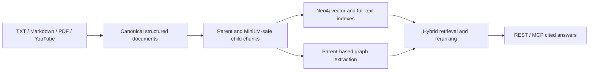
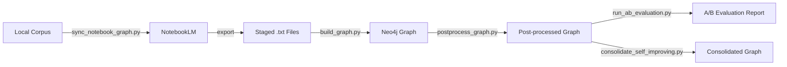

# notebooklm-graph-pipe

`notebooklm-graph-pipe` is a self-hosted corpus ingestion, vector RAG, and GraphRAG pipeline built on Neo4j. Its primary v3 workflow ingests local text, Markdown, PDF, and YouTube transcripts without NotebookLM, creates hierarchical retrieval chunks and native Neo4j vector/full-text indexes, extracts a knowledge graph, and exposes cited research through REST and MCP.

See [Local Neo4j Corpus RAG](docs/LOCAL_CORPUS_RAG.md) for the primary setup, migration, API, MCP, and operations guide.

## Primary Local Pipeline



Quick start:

```powershell
.\.venv\Scripts\python.exe scripts\sync_corpus_graph.py create `
  --dataset-dir C:\path\to\corpus `
  --corpus-title my-corpus

.\.venv\Scripts\python.exe scripts\serve_corpus_api.py
```

## Legacy NotebookLM Pipeline

The workflow below is retained temporarily for blue-green migration and historical benchmark compatibility. `sync_notebook_graph.py` is deprecated and delegates to the local corpus synchronizer when executed directly.

### Legacy Pipeline Overview



### Legacy Setup

- Python `3.12+`
- Google account signed into NotebookLM
- [`notebooklm-mcp`](https://github.com/jacob-bd/notebooklm-mcp-cli) and [`neo4j`](https://github.com/neo4j-contrib/mcp-neo4j) MCP servers configured for the bundled NotebookLM and graph workflows
- Docker if you want `scripts/sync_notebook_graph.py` to provision or resume a managed Neo4j container automatically, or your own Neo4j instance if you want to pass explicit `--neo4j-*` connection details
- One of the supported agents on `PATH`: `codex`, `claude`, or `opencode`

### 1. Install dependencies

```bash
git clone --recurse-submodules <repo-url>
cd llm-graph-builder-scripts
python -m venv .venv
source .venv/bin/activate
python -m pip install --upgrade pip
python -m pip install -r requirements.txt -c vendor/llm-graph-builder/backend/constraints.txt
```

### 2. Authenticate NotebookLM

```bash
nlm login
```

### 3. Environment Variables

Set provider keys only for the flows that use them:

```bash
# Optional - required for the default Google-backed postprocess/consolidation path,
# or whenever your routing config selects Google providers
export GOOGLE_API_KEY="your-key-here"

# Optional - only if your routing config selects these providers
export OPENAI_API_KEY="..."
export OPENROUTER_API_KEY="..."
```

### 4. Optional: use your own Neo4j instance

You do not need to provide Neo4j connection details to `scripts/sync_notebook_graph.py` by default. If you omit `--neo4j-uri`, `--neo4j-user`, `--neo4j-password`, and `--neo4j-database`, the sync workflow provisions or resumes a Docker-managed Neo4j runtime for you automatically.

Only pass explicit Neo4j flags when you want the scripts to target a Neo4j instance that you manage yourself:

```bash
python scripts/sync_notebook_graph.py create \
  --dataset-dir path/to/corpus \
  --notebook-title my-corpus \
  --neo4j-uri bolt://127.0.0.1:7687 \
  --neo4j-user neo4j \
  --neo4j-password your-password \
  --neo4j-database neo4j
```

For a hosted Neo4j deployment, prefer environment variables so the password is not exposed in process arguments or written to the project manifest. AuraDB uses the TLS and routing-enabled `neo4j+s://` URI supplied by Aura; the same variables work with other hosted Neo4j services and with `bolt+s://` endpoints:

```bash
export NEO4J_URI="neo4j+s://your-instance.databases.neo4j.io"
export NEO4J_USERNAME="neo4j"
export NEO4J_PASSWORD="your-password"
export NEO4J_DATABASE="neo4j"

python scripts/sync_corpus_graph.py create \
  --dataset-dir path/to/corpus \
  --corpus-title my-corpus
```

New corpus manifests record the URI, username, database, deployment type, and the name of the password environment variable. They do not store the password. Legacy manifests containing a `password` field remain readable, but are rewritten in the non-secret format on the next sync. Corpus ingestion and retrieval use stock Neo4j vector/full-text features and do not require APOC; the separate legacy consolidation workflow still requires its documented APOC Core procedures.

*Note: NotebookLM standard tier allows up to `100` notebooks and `50` sources per notebook. If source-count limits become a bottleneck, upgrade through [NotebookLM](https://support.google.com/notebooklm/answer/16213268?hl=en) or the [Google AI plans](https://one.google.com/intl/en/about/google-ai-plans).*

*Docker notes:*
- `scripts/sync_notebook_graph.py` can run without Docker when you provide explicit Neo4j credentials for your own instance
- `scripts/run_ab_evaluation.py --manifest-path ...` does not require Docker
- `scripts/run_ab_evaluation.py --datasets ...` auto-manages configured containers only when Docker is available
- newly provisioned managed containers use Neo4j `5.26.7`; existing `5.23` containers are not upgraded automatically

### 4a. Migrate a local graph to a hosted graph

The portable migration mode works through the Neo4j driver and is suitable for smaller v3 corpora and non-Aura hosted providers. It supports existing local `5.23` containers and does not require `neo4j-admin`:

```bash
export NEO4J_SOURCE_PASSWORD="local-password"
export NEO4J_TARGET_PASSWORD="hosted-password"

# Preflight only: verifies both endpoints and reports the copy plan.
python scripts/migrate_neo4j.py \
  --source-uri bolt://127.0.0.1:7687 \
  --target-uri neo4j+s://your-instance.databases.neo4j.io

# Execute the migration and activate the hosted target in the project manifest.
python scripts/migrate_neo4j.py \
  --source-uri bolt://127.0.0.1:7687 \
  --target-uri neo4j+s://your-instance.databases.neo4j.io \
  --manifest-path data/corpora/my-corpus/manifest.json \
  --execute \
  --activate-target
```

The target must contain no data or user-created schema. Replacing a populated target requires both `--overwrite-target` and an exact confirmation such as `--confirm-target "neo4j+s://your-instance.databases.neo4j.io|neo4j"`.

If a portable migration is interrupted after staging begins, rerun the same source and target with `--resume --execute`. Resume is accepted only when every target node belongs to that interrupted migration and no unrelated relationships are present; it is mutually exclusive with overwrite.

For large vector corpora, prefer Aura's native whole-database upload with a Neo4j `5.26 LTS+` dump:

```bash
python scripts/migrate_neo4j.py \
  --mode aura-upload \
  --dump-dir path/to/dumps \
  --source-database neo4j \
  --target-uri neo4j+s://your-instance.databases.neo4j.io \
  --overwrite-target \
  --confirm-target "neo4j+s://your-instance.databases.neo4j.io|neo4j" \
  --execute
```

Add `--source-container <managed-container-name>` plus the source connection variables to create the dump from a compatible managed container before upload. The utility stops that container, runs `neo4j-admin database dump` in a temporary sidecar sharing its data volumes, and restarts the source in `finally`; this also works with Community Edition, where `STOP DATABASE` is unavailable. A generated dump is removed after verified upload unless `--keep-dump` is supplied, and is retained after failure for retry. Aura upload is a whole-database replacement. The utility supplies the target password to `neo4j-admin` through the environment and verifies v3 corpus counts, active embeddings, schema, index readiness, and a native vector query after migration.

## Getting Started

### 5-minute path

Assuming you have completed the [Setup](#setup), the shortest path is to let `scripts/sync_notebook_graph.py` manage the Neo4j container automatically:

```bash
python scripts/sync_notebook_graph.py create \
  --dataset-dir path/to/your/corpus \
  --notebook-title my-corpus

python scripts/run_ab_evaluation.py \
  --manifest-path data/notebooklm_exports/my-corpus/manifest.json
```

This writes `data/notebooklm_exports/my-corpus/manifest.json`, stages NotebookLM exports under `sources/`, builds the graph, and runs the 4-factor A/B evaluation.

### What gets built

`scripts/build_graph.py` consumes staged NotebookLM-exported `.txt` files. When you run `scripts/sync_notebook_graph.py`, it executes the bridge from a local corpus to that staged format in this order:

- it walks the files under `--dataset-dir`
- it uploads those files into NotebookLM
- it exports NotebookLM source content into `data/notebooklm_exports/<project_slug>/sources/*.txt`
- it writes `manifest.json` with the notebook id and Neo4j runtime
- if you do not pass explicit `--neo4j-*` flags, it provisions or resumes a Docker-managed Neo4j runtime
- unless you pass `--skip-build`, it runs graph extraction from the staged `sources/` directory
- unless you pass `--skip-postprocess`, it runs the post-processing tail after graph extraction

Use local files that NotebookLM can ingest. The graph build itself always runs from the staged `.txt` exports.

### 1. Create or sync a notebook and build the graph

```bash
python scripts/sync_notebook_graph.py create \
  --dataset-dir path/to/corpus \
  --notebook-title my-corpus
```

Add `--skip-build` to stop after NotebookLM sync and manifest creation. Add `--skip-postprocess` to skip the post-processing tail after graph extraction. Add explicit `--neo4j-*` flags only if you want to use your own Neo4j instance instead of the managed Docker runtime.

### 2. Update an existing notebook and rebuild

```bash
python scripts/sync_notebook_graph.py update \
  --dataset-dir path/to/corpus \
  --notebook-id 12345678-1234-1234-1234-123456789abc
```

Explicit Neo4j flags on `update` override any managed Neo4j runtime recorded in the manifest.

### 3. Rebuild from staged NotebookLM exports

```bash
python scripts/build_graph.py \
  --sources-dir ./data/notebooklm_exports/my-corpus/sources \
  --neo4j-uri bolt://127.0.0.1:7687 \
  --neo4j-user neo4j \
  --neo4j-password your-password \
  --neo4j-database neo4j

python scripts/postprocess_graph.py \
  --neo4j-uri bolt://127.0.0.1:7687 \
  --neo4j-user neo4j \
  --neo4j-password your-password \
  --neo4j-database neo4j
```

These direct graph and postprocess entrypoints target a Neo4j instance explicitly, so pass `--neo4j-*` for the server you want to use.

### 4. Run A/B evaluation

```bash
python scripts/run_ab_evaluation.py \
  --manifest-path ./data/notebooklm_exports/my-corpus/manifest.json
```

Manifest-driven evaluation loads the notebook and Neo4j runtime from the manifest, generates `8` primary questions plus `2` reserves, runs `notebook_only` and `hybrid`, and scores them on correctness, completeness, evidence quality, and cross-document synthesis.

If you want to supply your own questions:

```bash
python scripts/run_ab_evaluation.py \
  --manifest-path ./data/notebooklm_exports/my-corpus/manifest.json \
  --questions-file path/to/questions.json \
  --dataset-label my-corpus
```

### 5. Run self-improving consolidation

```bash
python scripts/consolidation/consolidate_self_improving.py
```

Tier 1 handles lexical merges first. Tier 2 and Tier 3 then run in a self-improving loop until the consolidation gate passes or the iteration budget is exhausted.

## Providers, Agents, And Skills

The default local graph-build embedding is `sentence-transformer` with `all-MiniLM-L6-v2`. Routing config can switch embedding, prompt, and judge roles across these providers:

| Provider or runtime | Env variables | When required | Python dependency |
|---------------------|---------------|---------------|-------------------|
| `genai` / `gemini` | `GOOGLE_API_KEY` | Whenever `scripts/postprocess_graph.py` or the default consolidation flow uses Google-backed prompt / judge / embedding roles, or whenever `--llm-routing-config` selects Google-backed roles | `google-genai`, `langchain-google-vertexai` |
| `openai` | `OPENAI_API_KEY` | Whenever the routing config selects OpenAI for embeddings or single-prompt roles | `openai`, `langchain-openai` |
| `openrouter` | `OPENROUTER_API_KEY` | Whenever the routing config selects OpenRouter for embeddings or single-prompt roles | `openai`, `langchain-openai` |
| `codex` | ChatGPT subscription login (`codex login`) | Subscription-backed single-prompt roles; the CLI is invoked non-interactively with read-only sandboxing and structured JSON output | Codex CLI |
| `claude` | Claude subscription login (`claude auth login`) | Subscription-backed single-prompt roles; the CLI is invoked non-interactively with tools disabled and structured JSON output | Claude Code CLI |
| `sentence-transformer` | None | Default local graph-build embeddings, or whenever local embeddings are selected explicitly | `sentence-transformers`, `langchain-huggingface` |

Without `--llm-routing-config`, Tier 2, taxonomy, and Tier 3 use `minimax/minimax-m3` through OpenRouter for their primary prompt roles. Tier 2 escalates to subscription-authenticated `gpt-5.6-luna` through Codex at low reasoning effort, while Tier 3 escalates to the same model at medium effort. Taxonomy's secondary role remains `gemini-3.1-pro-preview`, and Tier 3 embeddings remain `gemini-embedding-001`, so default consolidation requires `OPENROUTER_API_KEY`, `GOOGLE_API_KEY`, and an authenticated Codex CLI. Set `reasoning_effort` to `low`, `medium`, `high`, or `xhigh` on a Codex single-prompt role; Claude supports `low`, `medium`, or `high`.

Supported agent runtimes for review or taxonomy-tail steps are `codex`, `claude`, and `opencode`. Without a routing config, consolidation defaults to `codex`.

The bundled `neo4j-corpus-deep-research` workflow is packaged for `.claude`, `.opencode`, and `.codex`. It alternates cited local corpus retrieval with Neo4j neighborhood expansion, keeps only source-verifiable branches, and stops when additional loops stop adding signal.

## MCP Tooling & Agent Skills

- Local corpus MCP (`scripts/serve_corpus_mcp.py`): cited corpus search, answers, source metadata, graph neighborhoods, and sync status
- [`neo4j`](https://github.com/neo4j-contrib/mcp-neo4j): schema reads and Cypher exploration

The bundled deep-research packages use the local corpus MCP and optionally the Neo4j MCP:

- `.codex/skills/neo4j-corpus-deep-research/`
- `.claude/agents/neo4j-corpus-deep-research.md`
- `.opencode/agents/neo4j-corpus-deep-research.md`

What the provided skill does:

- treats cited corpus retrieval as the high-context reader and Neo4j as the topology explorer
- starts from a grounded answer, extracts concrete entities, concepts, aliases, and open questions
- expands the strongest seeds through graph neighborhoods, then turns the best graph findings into tighter corpus follow-ups
- scores candidate branches for relevance, novelty, graph support, and explainability, and stops when the loop stops adding signal

Example use:

```text
Use the bundled neo4j-corpus-deep-research skill against corpus "my-corpus"
and its connected Neo4j graph. Research this question: "Which methods connect graph-based
retrieval with hallucination control in this corpus?" Use a 3-iteration loop budget and
return the full skill output.
```

In practice, that workflow queries the local corpus for an initial cited answer, extracts high-signal seeds, probes Neo4j for neighborhoods and bridge concepts, revalidates graph discoveries against source chunks, and returns a structured report with the final answer, iteration log, accepted/rejected branches, stop reason, and self-critique.

## Repo Layout And Overlay

- `vendor/llm-graph-builder/`: upstream `neo4j-labs/llm-graph-builder` submodule
- `src/`: local backend overlay modules that override selected upstream behavior
- `scripts/`: sync, graph build, post-processing, evaluation, and consolidation entrypoints
- `tests/`: regression coverage for orchestration and overlay behavior
- `.claude/`, `.opencode/`, `.codex/`: bundled agent and skill definitions

`src/` overlays `vendor/llm-graph-builder/backend/src`. Put local backend behavior changes in the overlay package, not in the vendored submodule.
