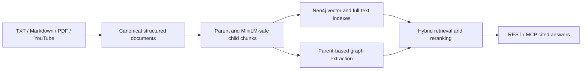

# Graphscribe

`graphscribe` is a self-hosted corpus ingestion, vector RAG, and GraphRAG pipeline built on Neo4j. Its primary v3 workflow ingests local text, Markdown, PDF, and YouTube transcripts without NotebookLM, creates hierarchical retrieval chunks and native Neo4j vector/full-text indexes, extracts a knowledge graph, and exposes cited research through REST and MCP.

See [Local Neo4j Corpus RAG](docs/LOCAL_CORPUS_RAG.md) for the primary setup, migration, API, MCP, and operations guide.

For routine additions to the Aura-authoritative compact parent-vector corpus, use the revision-scoped [Aura compact corpus update workflow](docs/AURA_COMPACT_CORPUS_UPDATES.md) or invoke `$update-aura-compact-corpus`. It updates parent embeddings and graph evidence without rerunning full consolidation.

## Primary Local Pipeline



Quick start:

```powershell
.\.venv\Scripts\python.exe scripts\sync_corpus_graph.py create `
  --dataset-dir C:\path\to\corpus `
  --corpus-title my-corpus

.\.venv\Scripts\python.exe scripts\serve_corpus_api.py
```

## Legacy NotebookLM Pipeline

Retained temporarily for blue-green migration and historical benchmark compatibility. `sync_notebook_graph.py` is deprecated and delegates to the local corpus synchronizer when executed directly. See [Legacy NotebookLM Pipeline](docs/LEGACY_NOTEBOOKLM_PIPELINE.md) for the full setup, migration, and getting-started guide.

## Providers, Agents, And Skills

The default local graph-build embedding is `sentence-transformer` with `all-MiniLM-L6-v2`. Routing config can switch embedding, prompt, and judge roles across these providers:

| Provider or runtime | Env variables | When required | Python dependency |
|---------------------|---------------|---------------|-------------------|
| `genai` / `gemini` | `GOOGLE_API_KEY` | Whenever `scripts/postprocess_graph.py` or the default consolidation flow uses Google-backed prompt / judge / embedding roles, or whenever `--llm-routing-config` selects Google-backed roles | `google-genai`, `langchain-google-vertexai` |
| `openai` | `OPENAI_API_KEY` | Whenever the routing config selects OpenAI for embeddings or single-prompt roles | `openai`, `langchain-openai` |
| `openrouter` | `OPENROUTER_API_KEY` | Whenever the routing config selects OpenRouter for embeddings or single-prompt roles | `openai`, `langchain-openai` |
| `codex` | ChatGPT subscription login (`codex login`) | Subscription-backed single-prompt roles; the CLI is invoked non-interactively with read-only sandboxing and structured JSON output | Codex CLI |
| `claude` | Claude subscription login (`claude auth login`) | Subscription-backed single-prompt roles; the CLI is invoked non-interactively with tools disabled and structured JSON output | Claude Code CLI |
| `sentence-transformer` | None | Default local graph-build embeddings, or whenever local embeddings are selected explicitly | `sentence-transformers`, `langchain-huggingface` |

Without `--llm-routing-config`, Tier 2, taxonomy, and Tier 3 use `minimax/minimax-m3` through OpenRouter for their primary prompt roles. Tier 2 escalates to subscription-authenticated `gpt-5.6-luna` through Codex at low reasoning effort, while Tier 3 escalates to the same model at medium effort. Taxonomy's secondary role remains `gemini-3.1-pro-preview`, and Tier 3 embeddings remain `gemini-embedding-001`, so default consolidation requires `OPENROUTER_API_KEY`, `GOOGLE_API_KEY`, and an authenticated Codex CLI. Set `reasoning_effort` to `low`, `medium`, `high`, or `xhigh` on a Codex single-prompt role; Claude supports `low`, `medium`, or `high`.

Supported agent runtimes for review or taxonomy-tail steps are `codex`, `claude`, and `opencode`. Without a routing config, consolidation defaults to `codex`.

The bundled `neo4j-corpus-deep-research` workflow is packaged for `.claude`, `.opencode`, and `.codex`. It alternates cited local corpus retrieval with Neo4j neighborhood expansion, keeps only source-verifiable branches, and stops when additional loops stop adding signal.

## MCP Tooling & Agent Skills

- Local corpus MCP (`scripts/serve_corpus_mcp.py`): cited corpus search, answers, source metadata, graph neighborhoods, and sync status
- [`neo4j`](https://github.com/neo4j-contrib/mcp-neo4j): schema reads and Cypher exploration

The bundled deep-research packages use the local corpus MCP and optionally the Neo4j MCP:

- `.codex/skills/neo4j-corpus-deep-research/`
- `.claude/agents/neo4j-corpus-deep-research.md`
- `.opencode/agents/neo4j-corpus-deep-research.md`

What the provided skill does:

- treats cited corpus retrieval as the high-context reader and Neo4j as the topology explorer
- starts from a grounded answer, extracts concrete entities, concepts, aliases, and open questions
- expands the strongest seeds through graph neighborhoods, then turns the best graph findings into tighter corpus follow-ups
- scores candidate branches for relevance, novelty, graph support, and explainability, and stops when the loop stops adding signal

Example use:

```text
Use the bundled neo4j-corpus-deep-research skill against corpus "my-corpus"
and its connected Neo4j graph. Research this question: "Which methods connect graph-based
retrieval with hallucination control in this corpus?" Use a 3-iteration loop budget and
return the full skill output.
```

In practice, that workflow queries the local corpus for an initial cited answer, extracts high-signal seeds, probes Neo4j for neighborhoods and bridge concepts, revalidates graph discoveries against source chunks, and returns a structured report with the final answer, iteration log, accepted/rejected branches, stop reason, and self-critique.

## Repo Layout And Overlay

- `vendor/llm-graph-builder/`: upstream `neo4j-labs/llm-graph-builder` submodule
- `src/`: local backend overlay modules that override selected upstream behavior
- `scripts/`: sync, graph build, post-processing, evaluation, and consolidation entrypoints
- `tests/`: regression coverage for orchestration and overlay behavior
- `.claude/`, `.opencode/`, `.codex/`: bundled agent and skill definitions

`src/` overlays `vendor/llm-graph-builder/backend/src`. Put local backend behavior changes in the overlay package, not in the vendored submodule.
